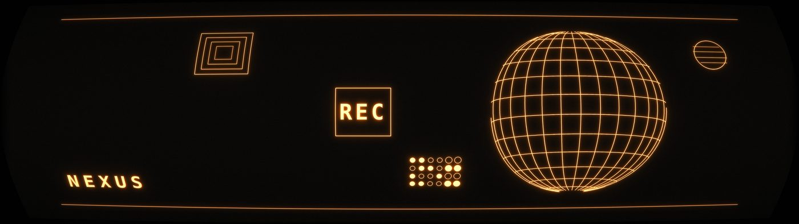
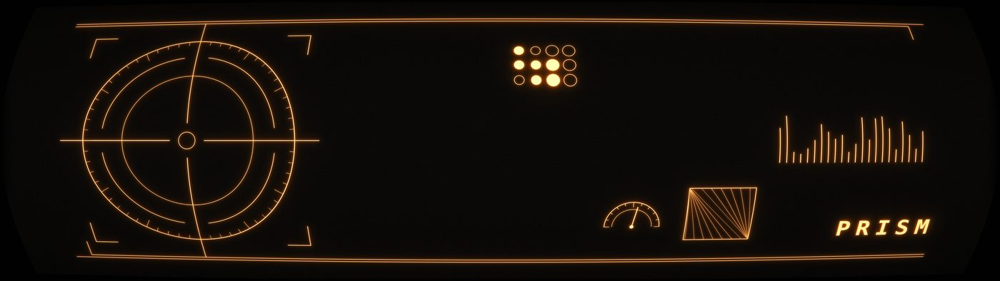
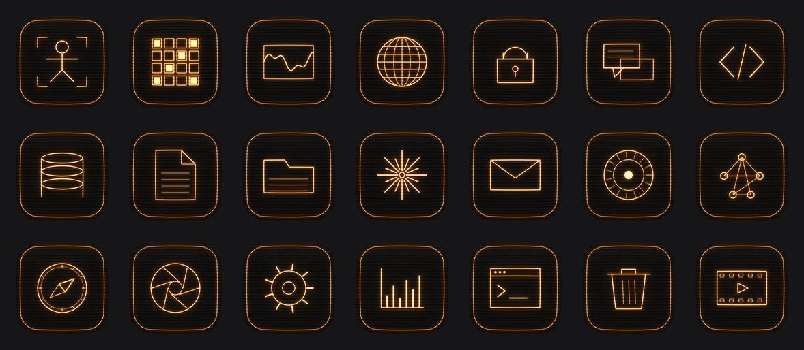

# Cassette futurism

Procedural wallpaper and macOS icon generator in the cassette futurism / terminal-UI style. Line art is drawn as vectors, bloomed like a phosphor tube, then run through a CRT stage: barrel distortion, chromatic aberration, curved scanlines, aperture mask.
Every image is seeded, so any output is reproducible from the number in its filename.

## Why

Couldn't find any wallpaper I liked for ultrawide res in this style, it was never quite the HUD feel I wanted, if I were to find it then I couldn't get a matching one for the laptop screen. Also was a fun challenge to learn bit more about python, quality could be better but for now it runs

## Install

Requires Python 3.9+.

```bash
git clone https://github.com/Gallyfreian/casette-futurism
cd cassette-futurism
python3 -m venv .venv && source .venv/bin/activate
pip install -r requirements.txt
```

On macOS, the venv is not optional — `pip install` against Homebrew's Python
without one fails with `externally-managed-environment`.

## Wallpapers

```bash
python3 wallgen.py --size 5120x1440 --count 20
python3 wallgen.py --size 3456x2234 --seed 7048 --palette amber
python3 wallgen.py --size 3840x2160 --crt 0.22 --busy 0.9 --palette blood
```

| flag         | default     | what it does                                                        |
| ------------ | ----------- | ------------------------------------------------------------------- |
| `--size`     | `5120x1440` | `WIDTHxHEIGHT`. Layout switches to the wide composition above 2.0:1 |
| `--count`    | `1`         | number of images; each gets a consecutive seed                      |
| `--seed`     | random      | reproduces a specific image                                         |
| `--palette`  | random      | `amber`, `green`, `ice`, `blood`, `bone`                            |
| `--crt`      | `0.14`      | barrel strength. `0.06` subtle, `0.24` heavy                        |
| `--flat`     | off         | disable the CRT stage entirely                                      |
| `--busy`     | `0.55`      | instrument clutter, `0.2` sparse to `1.0` dense                     |
| `--scan`     | `0.34`      | scanline depth, `0` off to `0.6` heavy                              |
| `--scan-px`  | `4.0`       | scanline period in output pixels. `4` at 4K, `2.5` at 1080p         |
| `--wordmark` | random      | fixed text, or `none` to omit                                       |

Six hero elements (wireframe globe, radar scope, perspective horizon, orbital system,
targeting reticle, oscilloscope), ten instrument widgets scattered into a slot grid,
three rail styles.

## Icons

`icongen.py` imports from `wallgen.py`, so keep them in the same directory.

```bash
python3 icongen.py --list
python3 icongen.py --out ./icons --palette green
python3 icongen.py --out ./icons --map "Chrome=globe,dev-work=code,Certs=lock"
```

| flag           | default      | what it does                                                        |
| -------------- | ------------ | ------------------------------------------------------------------- |
| `--out`        | `./icons`    | output directory                                                    |
| `--size`       | `1024`       | square PNG size                                                     |
| `--palette`    | `amber`      | same five palettes                                                  |
| `--map`        | full library | `"Filename=glyph,Filename=glyph"` pairs                             |
| `--label`      | off          | print the name across the bottom of each icon                       |
| `--crt`        | `0.12`       | tube bulge. Past `0.22` the tile stops matching the macOS icon grid |
| `--scan`       | `0.30`       | scanline depth                                                      |
| `--scan-lines` | `34`         | lines across the tile, counted so they survive Dock downscaling     |

21 glyphs: `folder`, `terminal`, `globe`, `code`, `compass`, `starburst`, `disc`,
`chat`, `person`, `document`, `aperture`, `film`, `bin`, `gear`, `waveform`,
`database`, `chart`, `lock`, `network`, `mail`, `grid`.

Output is 1024×1024 RGBA with the squircle as the alpha channel, so it sits on the
Dock without a black box.

### Applying icons on macOS

Select the app or folder ( command + I for Get Info), click the small icon top-left so it highlights, then drag and drop.

For batches, `brew install fileicon` then:

```bash
fileicon set /Applications/Ghostty.app ./icons/Ghostty.png
```

App icons set this way are wiped when the app updates, so keep the folder around.

## Notes and limitations

- **Barrel distortion is aspect-aware.** The naive shader approach normalises each
  axis to `[-1,1]` and takes `r² = u²+v²`, which produces a fisheye rather than a
  tube on a 3.55:1 canvas. Horizontal curvature is scaled by
  `ax = clamp((16/9)/aspect, 0.30, 1.0)` — 0.5 at 32:9.
- **Scanlines vanish below ~64px.** Resolution floor, nothing to be done. Use
  `--scan 0` and a stronger `--crt` if most of your usage is small sidebar icons.
- **The aperture mask** darkens two of every three subpixel columns by 9%. Invisible
  at 4K, but reads as a colour cast if you downscale the output. Set `mask=0` in
  `crt()` if that bites.
- **Font fallback** walks Menlo → Courier New → DejaVu Sans Mono → Liberation Mono →
  Consolas. If none resolve, add a path to `_FONTS` in `wallgen.py`.
- The corner radius is 22.37% of the tile, Apple's squircle ratio, but approximated
  with a rounded rectangle rather than a true superellipse.

## Preview

### Wallpapers

<p align="center">
  
</p>
<p align="center">
  
</p>

### Icons

<p align="center">
  
</p>

## Licence

MIT — see [LICENSE](LICENSE).
